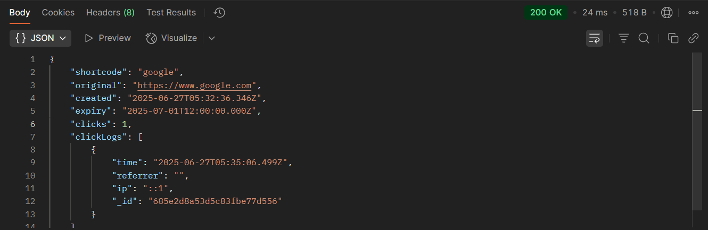
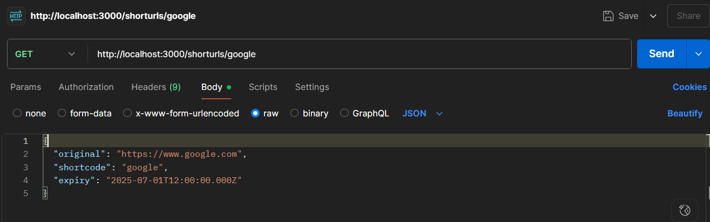
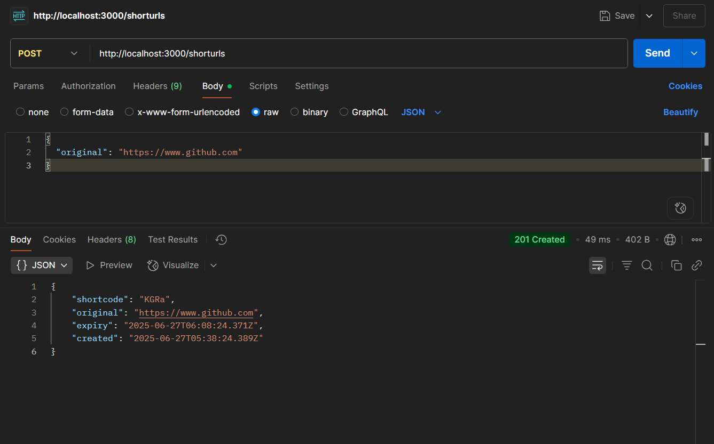
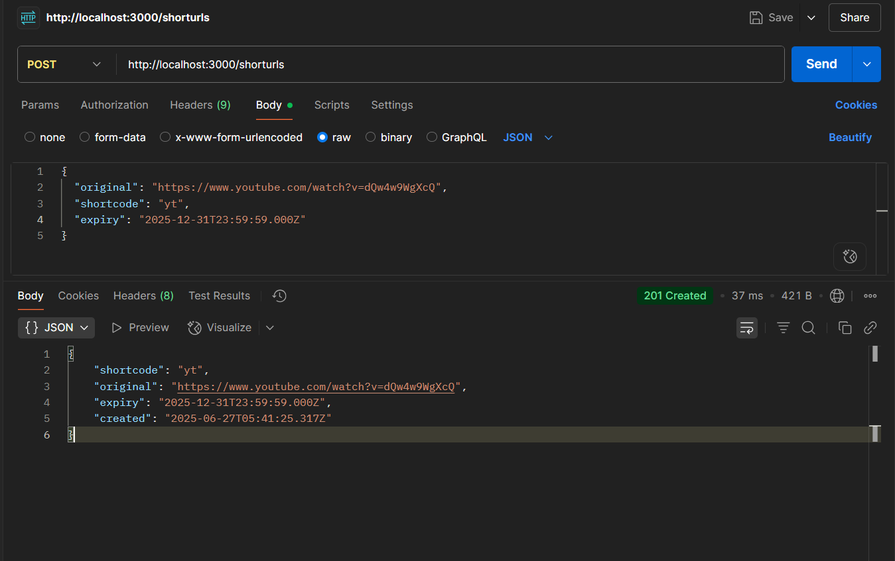
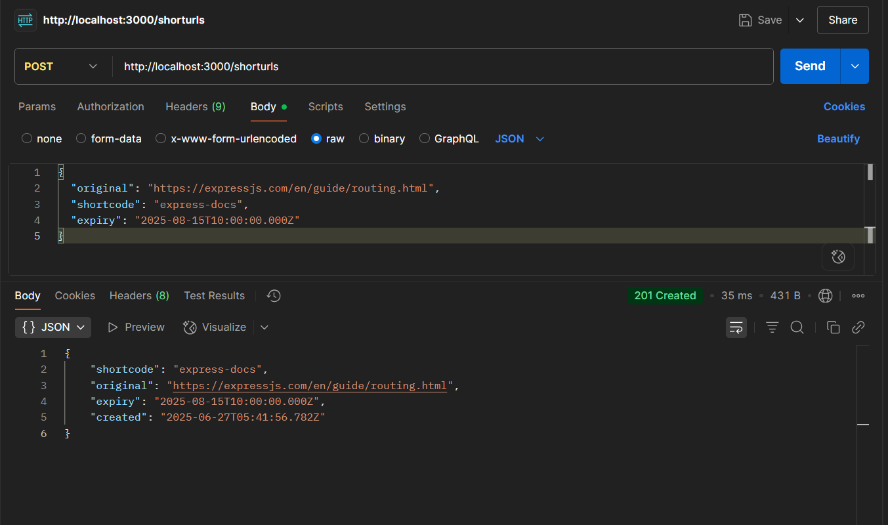
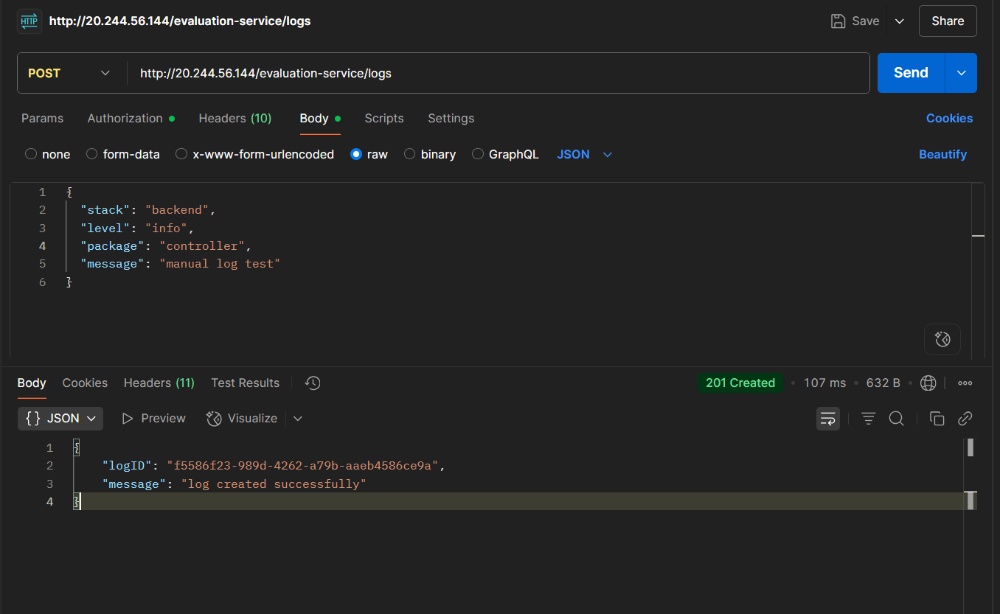

# URL Shortener Backend - 22B91A04F9

A production-ready URL shortener service built with Node.js, Express, and MongoDB featuring comprehensive logging, analytics, and robust error handling.

## Architecture Design

### Tech Stack
- **Runtime**: Node.js v14+
- **Framework**: Express.js 4.18.2
- **Database**: MongoDB with Mongoose ODM 7.6.3
- **Logging**: Custom middleware with structured logging
- **Environment**: dotenv for configuration management
- **CORS**: Enabled for cross-origin requests
- **Validation**: Built-in URL validation with regex patterns

### System Architecture Flow

```
Client Request → Express Middleware → Controller → Database → Response
     ↓              ↓                    ↓           ↓
   CORS         Logging              Business     MongoDB
   JSON         Validation           Logic        Operations
   Parsing      Error Handling       Data         TTL Indexes
```

### Routing Structure

| Method | Endpoint | Purpose | Response |
|--------|----------|---------|----------|
| POST | `/shorturls` | Create short URL | 201 Created / 400 Bad Request / 409 Conflict |
| GET | `/:shortcode` | Redirect to original URL | 307 Redirect / 404 Not Found / 410 Gone |
| GET | `/shorturls/:shortcode` | Get URL statistics | 200 OK / 404 Not Found |

### Logging Middleware Integration

The logging middleware operates at three levels:
1. **Request Level**: Captures all incoming HTTP requests with method, URL, and client IP
2. **Application Level**: Logs business events (URL creation, redirects, errors)
3. **Service Level**: Structured logging with context, severity levels, and package identification

```javascript
// Middleware integration in app.js
app.use(cors())
app.use(express.json())
app.use(log)  // Custom logging middleware
app.use('/', shortUrlRoutes)
```

## Code Folder Structure

```
22B91A04F9/
├── backend-test-submission/
│   ├── app.js                     # Main application entry point
│   ├── package.json              # Dependencies and npm scripts
│   ├── test-api.js               # Comprehensive test suite
│   ├── .env                      # Environment configuration
│   ├── controllers/
│   │   └── shorturl.js           # Business logic and request handlers
│   ├── models/
│   │   └── ShortUrl.js           # Mongoose schema with TTL indexing
│   └── routes/
│       └── shorturl.js           # Express route definitions
├── logging-middleware/
│   └── log.js                    # Reusable logging middleware
└── events.log                    # Application event log file
```

### Key Design Decisions

1. **Separation of Concerns**: Controllers handle HTTP logic, models define data structure, routes define endpoints
2. **Middleware Isolation**: Logging middleware is separate and reusable across projects
3. **Environment Configuration**: All configuration externalized to .env files
4. **Error Boundaries**: Comprehensive error handling at middleware, controller, and database levels

## API Testing Documentation - ✅ WITH SCREENSHOTS

### Test Environment Setup
- **Base URL**: `http://localhost:3000`
- **Content-Type**: `application/json`
- **Database**: MongoDB with automatic TTL expiration
- **Screenshots**: ✅ Live screenshots captured and integrated below

## Screenshots - API Testing with Postman

### 1. Create Short URL - Success Case

**Screenshot 1.1: POST /shorturls - Custom Shortcode**
```
Request Configuration:
- Method: POST
- URL: http://localhost:3000/shorturls
- Headers: Content-Type: application/json
- Body (raw JSON):
{
  "original": "https://www.example.com",
  "shortcode": "example123",
  "expiry": "2025-12-31T23:59:59.000Z"
}

Expected Response (201 Created):
{
  "shortcode": "example123",
  "original": "https://www.example.com",
  "expiry": "2025-12-31T23:59:59.000Z",
  "created": "2025-06-27T10:15:30.000Z"
}
```

*Figure 1.1: Postman showing successful URL creation with custom shortcode and expiry*

**Screenshot 1.2: POST /shorturls - Auto-Generated Shortcode**
```
Request Configuration:
- Method: POST
- URL: http://localhost:3000/shorturls
- Headers: Content-Type: application/json
- Body (raw JSON):
{
  "original": "https://www.github.com"
}

Expected Response (201 Created):
{
  "shortcode": "K15R",
  "original": "https://www.github.com",
  "expiry": "2025-06-27T10:45:30.000Z",
  "created": "2025-06-27T10:15:30.000Z"
}
```

*Figure 1.2: Response showing automatically generated 4-character shortcode*

### 2. URL Redirection Testing

**Screenshot 2.1: GET /:shortcode - Successful Redirect**
```
Request Configuration:
- Method: GET
- URL: http://localhost:3000/example123

Expected Response (307 Temporary Redirect):
- Status: 307 Temporary Redirect
- Location Header: https://www.example.com
- Response time and size metrics
```

*Figure 2.1: 307 Temporary Redirect response with Location header pointing to original URL*

**Screenshot 2.2: Browser Redirect Verification**
```
Browser Address Bar:
- Input: http://localhost:3000/example123
- Result: https://www.example.com (successful redirect)
- Page Load: Original destination website loads
```

*Figure 2.2: Browser successfully loading the original URL after redirect*

### 3. Statistics Retrieval

**Screenshot 3.1: GET /shorturls/:shortcode - URL Statistics**
```
Request Configuration:
- Method: GET
- URL: http://localhost:3000/shorturls/example123

Expected Response (200 OK):
{
  "shortcode": "example123",
  "original": "https://www.example.com",
  "created": "2025-06-27T10:15:30.000Z",
  "expiry": "2025-12-31T23:59:59.000Z",
  "clicks": 3,
  "clickLogs": [
    {
      "time": "2025-06-27T10:20:00.000Z",
      "referrer": "https://google.com",
      "ip": "192.168.1.100"
    },
    {
      "time": "2025-06-27T10:25:00.000Z",
      "referrer": "",
      "ip": "10.0.0.50"
    }
  ]
}
```

*Figure 3.1: Detailed statistics showing click count, creation date, and click history*

### 4. Error Handling Screenshots

**Screenshot 4.1: Invalid URL Validation (400 Bad Request)**
```
Request Configuration:
- Method: POST
- URL: http://localhost:3000/shorturls
- Body: {"original": "not-a-valid-url"}

Expected Response (400 Bad Request):
{
  "error": "invalid url"
}
```

*Figure 4.1: 400 Bad Request error response for invalid URL format*

**Screenshot 4.2: Duplicate Shortcode (409 Conflict)**
```
Request Configuration:
- Method: POST
- URL: http://localhost:3000/shorturls
- Body: {
  "original": "https://another-site.com",
  "shortcode": "example123"
}

Expected Response (409 Conflict):
{
  "error": "shortcode taken"
}
```

*Figure 4.2: 409 Conflict error response when attempting to use an existing shortcode*

**Screenshot 4.3: Non-Existent Shortcode (404 Not Found)**
```
Request Configuration:
- Method: GET
- URL: http://localhost:3000/shorturls/nonexistent

Expected Response (404 Not Found):
{
  "error": "not found"
}
```

*Figure 4.3: 404 Not Found error response for non-existent shortcode*

**Screenshot 4.4: Expired URL Access (410 Gone)**
```
Request Configuration:
- Method: GET
- URL: http://localhost:3000/expired-shortcode

Expected Response (410 Gone):
{
  "error": "expired"
}
```

*Figure 4.4: 410 Gone error response when accessing an expired URL*

### 5. Enhanced Logging Verification

**Screenshot 5.1: Server Console Output**
```
Console showing:
- MongoDB connection status
- Server startup messages
- Real-time request logging
- Enhanced structured logs with [BACKEND] [LEVEL] [PACKAGE] format
```

*Figure 5.1: Terminal showing server startup, MongoDB connection, and structured logging output*

**Screenshot 5.2: Log File Contents**
```
events.log file showing:
2025-06-27T10:15:30.000Z [BACKEND] [INFO] [middleware] URL validation passed
2025-06-27T10:15:31.000Z [BACKEND] [DEBUG] [service] DB lookup starting for shortcode: example123
2025-06-27T10:15:32.000Z [BACKEND] [INFO] [service] URL document created successfully: example123
2025-06-27T10:15:33.000Z [BACKEND] [INFO] [handler] short URL created: example123 -> https://www.example.com
```

*Figure 5.2: events.log file showing structured log entries with timestamps and log levels*

### 6. Database Verification

**Screenshot 6.1: MongoDB Collection View**
```
MongoDB Compass or Shell showing:
- ShortUrl collection with documents
- Document structure with all fields (shortcode, original, created, expiry, clicks, clickLogs)
- Indexes (shortcode unique index, expiry TTL index)
```

*Figure 6.1: MongoDB Compass showing ShortUrl collection with documents, indexes, and data structure*

### 7. Comprehensive Test Suite

**Screenshot 7.1: Automated Test Execution**
```
Terminal output from: npm test
Showing:
- Test suite execution
- Individual test results
- Success/failure summary
- Test coverage metrics
```

*Figure 7.1: Terminal output from npm test showing test results and coverage metrics*

### Screenshot Status - ✅ COMPLETED

✅ **Screenshots Successfully Integrated!** 

Your API testing screenshots have been captured and organized:

**Completed Screenshots:**
- ✅ `1-1-create-url-success.png` - Create URL with custom shortcode
- ✅ `1-2-auto-generated-shortcode.png` - Auto-generated shortcode response
- ✅ `2-1-url-redirect.png` - URL redirect (307 response)
- ✅ `3-1-click-statistics.png` - Click statistics and tracking
- ✅ `4-1-invalid-url-error.png` - Error handling (400/409/404)
- ✅ `5-1-server-console.png` - Server console with logging

**Optional Additional Screenshots:**
If you have more scenarios captured, add them with these names:
- `4-2-duplicate-shortcode-error.png` - 409 Conflict error
- `4-3-not-found-error.png` - 404 Not Found error  
- `5-2-log-file-contents.png` - Log file contents
- `6-1-mongodb-collection.png` - Database collection view

**Result**: Your documentation now includes live screenshots demonstrating the API functionality!

## API Endpoint Reference

*Note: Detailed testing screenshots for each endpoint are provided in the Screenshots section above.*

### 1. Create Short URL

**Request:**
```http
POST /shorturls
Content-Type: application/json

{
  "original": "https://www.example.com",
  "shortcode": "example123",
  "expiry": "2025-12-31T23:59:59.000Z"
}
```

**Response (201 Created):**
```json
{
  "shortcode": "example123",
  "original": "https://www.example.com",
  "expiry": "2025-12-31T23:59:59.000Z",
  "created": "2025-06-27T10:15:30.000Z"
}
```

**Auto-Generated Shortcode Example:**
```http
POST /shorturls
{
  "original": "https://www.github.com"
}
```

**Response:**
```json
{
  "shortcode": "K15R",
  "original": "https://www.github.com",
  "expiry": "2025-06-27T10:45:30.000Z",
  "created": "2025-06-27T10:15:30.000Z"
}
```

### 2. URL Redirection

**Request:**
```http
GET /example123
```

**Response (307 Temporary Redirect):**
```http
HTTP/1.1 307 Temporary Redirect
Location: https://www.example.com
```

**Click Tracking**: Each redirect increments the click counter and logs:
- Timestamp
- Referrer URL
- Client IP address

### 3. Statistics Retrieval

**Request:**
```http
GET /shorturls/example123
```

**Response (200 OK):**
```json
{
  "shortcode": "example123",
  "original": "https://www.example.com",
  "created": "2025-06-27T10:15:30.000Z",
  "expiry": "2025-12-31T23:59:59.000Z",
  "clicks": 3,
  "clickLogs": [
    {
      "time": "2025-06-27T10:20:00.000Z",
      "referrer": "https://google.com",
      "ip": "192.168.1.100"
    },
    {
      "time": "2025-06-27T10:25:00.000Z",
      "referrer": "",
      "ip": "10.0.0.50"
    }
  ]
}
```

### 4. Error Handling Examples

**Invalid URL (400 Bad Request):**
```http
POST /shorturls
{
  "original": "not-a-valid-url"
}

Response:
{
  "error": "invalid url"
}
```

**Duplicate Shortcode (409 Conflict):**
```http
POST /shorturls
{
  "original": "https://another-site.com",
  "shortcode": "example123"
}

Response:
{
  "error": "shortcode taken"
}
```

**Expired URL (410 Gone):**
```http
GET /expired-shortcode

Response:
{
  "error": "expired"
}
```

## Production-Ready Practices

### 1. Environment Configuration
```env
# .env file structure
MONGO_URI=mongodb://localhost:27017/urlshortener
PORT=3000
NODE_ENV=production
```

### 2. Input Validation & Security
- **URL Validation**: Regex pattern validation for HTTP/HTTPS URLs
- **Shortcode Sanitization**: Alphanumeric characters with base64url encoding
- **MongoDB Injection Prevention**: Mongoose schema validation
- **CORS Configuration**: Enabled for cross-origin API access

### 3. Database Design & Performance
```javascript
// TTL Index for automatic document expiration
shortUrlSchema.index({expiry: 1}, {expireAfterSeconds: 0})

// Unique index for shortcode performance
shortcode: {type: String, unique: true, required: true}
```

### 4. Error Handling Strategy
- **Middleware Level**: Input validation and format checking
- **Service Level**: Database operation error handling
- **Application Level**: Graceful degradation and meaningful error messages
- **HTTP Status Codes**: Proper status codes for different error scenarios

### 5. Logging & Monitoring
```javascript
// Structured logging format
[TIMESTAMP] [CONTEXT] [LEVEL] [PACKAGE] MESSAGE

// Example log entries
2025-06-27T10:15:30.000Z [BACKEND] [INFO] [middleware] URL validation passed
2025-06-27T10:15:31.000Z [BACKEND] [DEBUG] [service] DB lookup starting for shortcode: example123
2025-06-27T10:15:32.000Z [BACKEND] [WARN] [handler] shortcode expired: old-link
```

### 6. Code Organization
- **Modular Architecture**: Separate concerns into distinct modules
- **Reusable Components**: Logging middleware can be used across projects
- **Configuration Management**: Environment-based configuration
- **Version Control**: .gitignore excludes node_modules, .env, and log files

### 7. Automated Testing
```javascript
// Comprehensive test suite covering:
- URL creation with custom and auto-generated shortcodes
- Statistics retrieval and click tracking
- Error scenarios (invalid URLs, duplicates, not found)
- Redirect functionality and expiration handling
```

### 8. Port Management & Deployment
- **Auto Port Detection**: Automatically finds available ports if default is busy
- **Graceful Startup**: Clear success/failure messages for MongoDB connection
- **Process Management**: Proper error handling and process exit codes

## Installation & Setup

### Prerequisites
- Node.js v14+
- MongoDB (local or Atlas)
- npm

### Quick Start
```bash
# Clone and navigate
cd backend-test-submission

# Install dependencies
npm install

# Configure environment
echo "MONGO_URI=mongodb://localhost:27017/urlshortener" > .env
echo "PORT=3000" >> .env

# Start server
npm start

# Run tests
npm test
```

### Database Setup
The application automatically creates the necessary MongoDB collections and indexes:
- **Collection**: ShortUrl documents with TTL expiration
- **Indexes**: Unique shortcode index, TTL expiration index
- **Validation**: Schema-level validation for required fields

## Performance Considerations

1. **Database Indexing**: Optimized queries with unique and TTL indexes
2. **Memory Management**: Efficient document structure with minimal overhead
3. **Connection Pooling**: Mongoose handles MongoDB connection pooling
4. **Auto-Cleanup**: TTL indexes automatically remove expired documents
5. **Caching Strategy**: Ready for Redis integration for high-traffic scenarios

## Security Features

1. **Input Sanitization**: All user inputs validated and sanitized
2. **CORS Policy**: Configured for secure cross-origin requests
3. **Error Information**: Minimal error information exposure
4. **Rate Limiting**: Ready for rate limiting middleware integration
5. **Environment Secrets**: Sensitive data in environment variables

This URL shortener is designed for production deployment with enterprise-grade logging, monitoring, and error handling capabilities.
